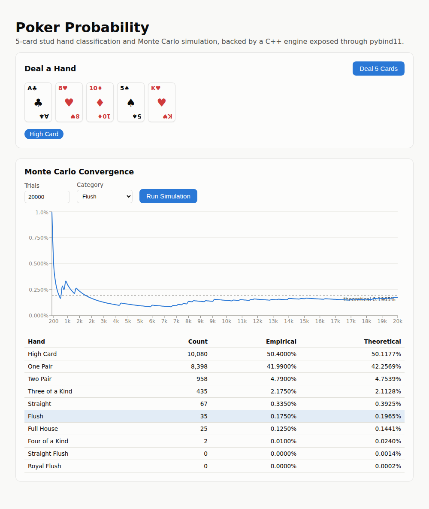

# Poker Probability

A 5-card stud hand classifier and Monte Carlo simulator, with a C++ engine
underneath a full-stack web app.



This started as a single-file console program (`PokerProbability.cpp` in the
git history) that shuffled a 52-card deck and counted how often it dealt a
flush. This version keeps that same idea -- shuffle, deal, classify, repeat --
but rebuilds it end to end:

- The card/deck/hand logic is a tested, reusable C++ library instead of code
  living in `main()`.
- The original's four independent hand checks (`is_flush`, `is_straight`,
  `is_straight_flush`, and an `is_4of_akind` exercise that compared all five
  cards' ranks and so could never actually fire on a real deck) are replaced
  by a single rank/suit histogram that correctly classifies all ten standard
  poker hand categories, including four-of-a-kind, full house, and royal vs.
  ordinary straight flush.
- That library is exposed to Python via [pybind11](https://pybind11.readthedocs.io/),
  wrapped in a FastAPI backend, and driven from a React frontend that shows
  the empirical probability of a chosen hand category converging live, trial
  by trial, toward the closed-form combinatorial probability.

## Architecture

```
┌─────────────┐   pybind11    ┌──────────────┐   REST / WebSocket   ┌─────────────┐
│  C++ engine │──────────────▶│   FastAPI    │◀─────────────────────│    React    │
│ card/deck/  │  (GIL released│   backend    │   /api/deal          │  frontend   │
│ hand/       │   during the  │              │   /api/simulate      │ (Vite + TS) │
│ simulator   │   Monte Carlo │              │   /ws/simulate       │             │
└─────────────┘   loop)       └──────────────┘                      └─────────────┘
       ▲
       │ doctest
┌─────────────┐
│ engine tests│
└─────────────┘
```

- **engine/** -- the domain model. `Card` / `Rank` / `Suit`, a `Deck` that
  owns all shuffling and dealing, a `Hand` that classifies itself, and a
  `MonteCarloSimulator` that repeatedly deals and tallies. Zero dependency on
  Python or the web; it builds and tests standalone. `engine/tests/` is a
  vendored [doctest](https://github.com/doctest/doctest) suite: known hands
  for every category (including the ace-low `A-2-3-4-5` and ace-high
  `10-J-Q-K-A` straight edge cases), a deck-integrity check, and a 2,000,000-trial
  convergence test with an 8-standard-deviation tolerance band around each
  category's binomial expectation -- wide enough to never flake, tight enough
  to actually catch a broken simulator.
- **engine/bindings/** -- a pybind11 module (`poker_engine`) that wraps the
  engine for Python. The simulation loop releases the GIL for the C++ work
  and re-acquires it only for the periodic progress callback, so a FastAPI
  worker thread running a multi-million-trial simulation doesn't stall the
  event loop.
- **backend/** -- FastAPI. `POST /api/deal` deals and classifies one hand.
  `POST /api/simulate` runs a fixed-size simulation. `WS /ws/simulate` streams
  ~200 progress snapshots over the course of a run (offloaded to a worker
  thread via `asyncio.to_thread`) so the frontend chart updates live instead
  of waiting for the whole thing to finish.
- **frontend/** -- React + TypeScript (Vite). One panel deals and displays a
  hand; the other lets you pick a hand category and trial count, then plots
  that category's running empirical probability against a dashed line at the
  theoretical value, with a table underneath comparing all ten categories
  (a single shared chart doesn't work here -- High Card is ~50% and Royal
  Flush is ~0.0002%, six orders of magnitude apart, so only one category is
  charted at a time and the table carries the rest).

## Running it

**Docker (recommended):**

```bash
docker compose up --build
```

Then open <http://localhost:8080>. The frontend container serves the built
React app via nginx and proxies `/api` and `/ws` to the backend container.

**Locally, without Docker:**

```bash
# 1. Build the C++ engine, run its tests, and build the pybind11 module
pip install pybind11
./engine/build.sh

# 2. Backend
cd backend
python3 -m venv .venv && source .venv/bin/activate
pip install -r requirements.txt
python -m pytest tests/ -v
uvicorn app.main:app --reload

# 3. Frontend (separate terminal)
cd frontend
npm install
npm run dev
```

The frontend dev server proxies `/api` and `/ws` to `localhost:8000` (see
`frontend/vite.config.ts`), so run the backend first.

## Testing

- `./build/engine/poker_engine_tests` -- C++ unit + statistical tests (doctest)
- `cd backend && python -m pytest tests/ -v` -- API tests, including a full
  WebSocket streaming round-trip
- `cd frontend && npm run build` -- type-checks and builds the frontend

All three run on every push via GitHub Actions (`.github/workflows/ci.yml`),
along with a build of both Docker images.

## Why a C++ core behind a Python API

The original project was a systems-level exercise: hand-rolled ADTs, no
external dependencies, STL algorithms doing the work. Rewriting it purely in
Python for the web would have thrown that away. Instead the C++ stays the
actual engine -- pybind11 is a boundary, not a rewrite -- so the web app is
provably running the same, tested classification and simulation logic as the
standalone engine, and the interesting systems question (how do you stream
progress out of a long-running C++ loop without blocking an async server)
stays real instead of being simulated in pure Python.
